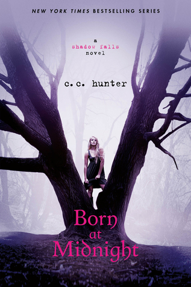

<html>
	<head>
		<title>Our Favourite Books</title>
	</head>
	<body>
	<a href="series.html">Click here to take a look at our favorite series!</a>
		 
		<a href="index.html">Click here to go back to the home page.</a>
		 

		<h1>We read a lot of different genres! So, here are our top recommendation based on the following genres:</h1>

		<h2>1. Mystery</h2>
		<h3><u>And Then There Were None</u></h3>
		<h4>Agatha Christie</h4>
		<h5>
			Summary: Ten strangers, each lured to Indian Island by a mysterious host. Once his guests have arrived,  the host accuses each person of murder.
		</h5>
			
			  
			<a href="https://www.goodreads.com/book/show/16299.And_Then_There_Were_None">Check it out on Goodreads!</a>
			 
			<a href="https://www.amazon.ca/Then-There-Were-None/dp/0062073486/ref=sr_1_1?crid=3N2QLTZKC0S3H&dchild=1&keywords=and+then+there+were+none&qid=1619892417&sprefix=and+then+there%2Caps%2C163&sr=8-1">
			Sounds like the book for you? Get it now on Amazon!
			</a>
			   

		<h3>
			<u>Don't Cry Now</u>
		</h3>
		<h4>
			Joy Fielding
		</h4>
		<h5>
			Summary: "You're in danger. You and Amanda." 
			The warning draws Bonnie Wheeler to a place she has never been: 
			To the brutally slain body of her husband's ex-wife...
			 
			To the shattering of her perfect world by a murdered woman's secrets... 
			To a place where every truth becomes a lie—and every loved one is a stranger... 
			To a gathering darkness that threatens her innocent child—and herself... 
			To a home where nothing is safe, and there's no one she can trust. 
		</h5>
		
		  
		<a href="https://www.goodreads.com/book/show/256502.Don_t_Cry_Now">
			Check it out on Goodreads!
		</a>
		 
		<a href="https://www.amazon.ca/Dont-cry-now-Joy-Fielding/dp/0688126731/ref=tmm_hrd_swatch_0?_encoding=UTF8&qid=1620079249&sr=1-1">
			Sounds like the book for you? Get it now on Amazon!
		</a>
		   

		<h3>
			<u>Murder On The Orient Express</u>
		</h3>
		<h4>
			Agatha Christie
		</h4>
		<h5>
			Summary: Just after midnight, a snowdrift stops the Orient Express in its tracks. The luxurious train is surprisingly full for the time of the year, but by the morning it is one passenger fewer. An American tycoon lies dead in his compartment, stabbed a dozen times, his door locked from the inside. 
			Isolated and with a killer in their midst, detective Hercule Poirot must identify the murderer—in case he or she decides to strike again.
		</h5>
		
		  
		<a href="https://www.goodreads.com/book/show/853510.Murder_on_the_Orient_Express">
			Check it out on Goodreads!
		</a>
		 
		<a href="https://www.amazon.ca/Murder-Orient-Express-Hercule-Mystery/dp/0062073508/ref=sr_1_1?dchild=1&keywords=murder+on+the+orient+express+book&qid=1620000134&sr=8-1">
			Sounds like the book for you? Get it now on Amazon!
		</a>
		   

		<h2>2. Fantasy</h2>

		<h3>
			<u>Ruthless Boys of the Zodiac: Dark Fae</u>
		</h3>
		<h4>
			Caroline Peckham & Susanne Valenti
		</h4>
		<h5>
			Summary: 
			When I kicked the ass of a Werewolf who was high on a new and dangerous drug called Killblaze, his final words painted a dark reality for me. The King of Aurora Academy killed my brother. The trouble is, there’s four kings at that school and each of them have motive and cutthroat natures. 
			I might be a petite, lilac-haired girl who looks like a fragile doll, but they haven’t been introduced to my fangs yet. And they don’t know why I’m really here. Or that I’ll do whatever it takes to bring down the Fae who took my flesh and blood from me. 
			I don’t believe in fate, but I do know this… the King who killed my brother is a dead man walking. And I’m prepared to sacrifice my heart, body and soul to ensure I get my revenge. 
		</h5>
		
		  
		<a href="https://www.goodreads.com/book/show/52708823-dark-fae">
			Check it out on Goodreads!
		</a>
		 
		<a href="https://www.amazon.ca/Dark-Fae-Caroline-Peckham/dp/B083XVYM2P/ref=tmm_pap_swatch_0?_encoding=UTF8&qid=1620077652&sr=1-1">
			Sounds like the book for you? Get it now on Amazon!
		</a>
		   

		<h3><u>Mistborn: The Final Empire</u></h3>
		<h4>Brandon Sanderson</h4>
		<h5>
			Summary: For a thousand years the Lord Ruler reigned with absolute power and ultimate terror, divinely invincible. Then, when hope was so long lost, a terribly scarred, heart-broken half-Skaa rediscovered it in the depths of the Lord Ruler's most hellish prison. Kelsier "snapped" and found in himself the powers of a Mistborn. Kelsier recruited the underworld's elite, the smartest and most trustworthy allomancers,  each of whom shares one of his many powers and reveals his ultimate dream, not just the greatest heist in history, but the downfall of the divine despot.

		</h5>
			
			  
			<a href="https://www.goodreads.com/book/show/68428.Mistborn">
			Check it out on Goodreads!
			</a>
			 
			<a href="https://www.amazon.ca/Mistborn-Final-Empire-Brandon-Sanderson/dp/0765377136/ref=tmm_pap_swatch_0?_encoding=UTF8&qid=1619893364&sr=8-1">
			Sounds like the book for you? Get it now on Amazon!
			</a>
			   

		<h3>
			<u>Kit Davenport: The Vixen's Lead</u>
		</h3>
		<h4>
			Tate James
		</h4>
		<h5>
			Summary: 
			I want vengeance so badly that I can almost taste it. It's all I've ever wanted. So, I did what any privileged, adopted boarding school girl would do. I slapped on a secret identity and became an internationally renowned thief, known as The Fox. Nobody knows me. Nobody can catch me. 
			Or so I thought... 
			It turns out; I have what they want. Special abilities. And trust me, these abilities are coveted--and dangerous. Now, I don't know who to trust or where to go. Peril lurks on every corner as I try to uncover my past and origin. Teaming up with unlikely allies may be my only chance at survival or my biggest mistake. Only time will tell. 
			I'm Kit Davenport and this is only the beginning. 
		</h5>
		
		  
		<a href="https://www.goodreads.com/book/show/35721433-the-vixen-s-lead">
			Check it out on Goodreads!
		</a>
		 
		<a href="https://www.amazon.ca/Vixens-Lead-Tate-James/dp/1975607147/ref=tmm_pap_swatch_0?_encoding=UTF8&qid=1620009930&sr=8-4">
			Sounds like the book for you? Get it now on Amazon!
		</a>
		   

		<h3>
			<u>Shadow Falls: Born at Midnight</u>
		</h3>
		<h4>
			C.C. Hunter
		</h4>
		<h5>
			Summary: 
			Kylie Galen has never felt normal. One night she finds herself at the wrong party, with the wrong people, and it changes her life forever. Her mother ships her off to Shadow Falls-a camp for troubled teens—but within hours of arriving, it becomes clear that her fellow campers aren't "troubled." Here at Shadow Falls, vampires, werewolves, shapeshifters, witches and fairies train side by side—learning to harness their powers, control their magic, and live in the normal world. They insist Kylie is one of them, and that she was brought to Shadow Falls for a reason.
			Even though Kylie is uncertain about everything, she starts to realize that Shadow Falls is exactly where she belongs…
		</h5>
		
		  
		<a href="https://www.goodreads.com/book/show/8705784-born-at-midnight">
			Check it out on Goodreads!
		</a>
		 
		<a href="https://www.amazon.ca/Born-Midnight-Shadow-Falls-Book-ebook/dp/B004L2LGOC/ref=sr_1_1?dchild=1&keywords=born+at+midnight&qid=1620063893&s=digital-text&sr=1-1">
			Sounds like the book for you? Get it now on Amazon!
		</a>
		   

		<h2>3. Romance</h2>

		<h3><u>Zodiac Academy: The Awakening</u></h3>
		<h4>Caroline Peckham & Susanne Valenti</h4>
		<h5>
			Summary: Changelings were outlawed hundreds of years ago but I guess our birth parents didn't get the memo  Which means we're totally unprepared for the ruthless world of Fae. 
			Air. Fire. Water. Earth. 
			No one has ever harnessed all four of them, until we arrived. As the rarest Elementals ever known, we're already a threat to the four celestial heirs; the popular, vindictive bullies who happen to be some of the hottest guys we've ever seen. It doesn't help that they're the most dangerous beasts in the Academy. And probably on earth too. We never knew we had a birthright to live up to but now that we do, we intend to claim our throne. So if the dragon shifters want some target practice, the werewolves want someone to hunt or the vampires fancy a snack then we have to be ready. But we've been looking after each other for a long time and fighting back is in our blood. 
			Today's horoscope: totally screwed. 

		</h5>
			
			  
			<a href="https://www.goodreads.com/book/show/46261182-zodiac-academy">
			Check it out on Goodreads!
			</a>
			 
			<a href="https://www.amazon.ca/Zodiac-Academy-Awakening-Caroline-Peckham/dp/1080415041/ref=sr_1_1?dchild=1&keywords=zodiac+academy&qid=1620009202&sr=8-1">
			Sounds like the book for you? Get it now on Amazon!
			</a>
			   

		<h3><u>The Villain</u></h3>
		<h4>L.J. Shen</h4>
		<h5>
			Summary: 
			Cruel. Coldblooded. Hades in a Brioni suit. 
			Cillian Fitzpatrick has been dubbed every wicked thing on planet earth. 
			To the media, he is The Villain. 
			To me, he is the man who (reluctantly) saved my life. 
			Now I need him to do me another, small solid. 
			Only Cillian doesn’t hand out free favors. 
			His price, it turns out, is my freedom. 
			Too bad Cillian forgot one, tiny detail. 
			Persephone wasn’t only the goddess of spring; she was also the queen of death. 
			He is about to find out the most lethal poison is also the sweetest. 

		</h5>
			
			  
			<a href="https://www.goodreads.com/book/show/52322156-the-villain">
			Check it out on Goodreads!
			</a>
			 
			<a href="https://www.amazon.ca/Villain-Billionaire-Romance-L-J-Shen-ebook/dp/B08PW1Z5NN/ref=sr_1_1?dchild=1&keywords=the+villain&qid=1620064581&s=digital-text&sr=1-1">
			Sounds like the book for you? Get it now on Amazon!
			</a>
			   

		

		<h3>
			<u>The Devil Wears Black</u>
		</h3>
		<h4>
			L.J. Shen
		</h4>
		<h5>
			Summary: 
			Maddie Goldbloom stitched up a plan to ensure everything in her life was perfect―from a career in fashion to a chic NYC apartment to a pediatrician boyfriend.
			When her ex, Chase Black, storms back into her life with an outrageous request, her immediate reaction is to refuse him. But he only wants to fulfill his father’s last wish. So even though he’s the man who broke her heart, playing his fiancée shouldn’t be hard, especially if it means she gets to watch the arrogant devil squirm a bit. What ensues is a chain of events that detonates Maddie’s life―and when Chase’s walls come down, they both are forced to face reality. 
			They say keep your enemies close. But what if your enemy is also the man you love? 
		</h5>
		
		  
		<a href="https://www.goodreads.com/book/show/50724052-the-devil-wears-black">
			Check it out on Goodreads!
		</a>
		 
		<a href="https://www.amazon.ca/Devil-Wears-Black-L-J-Shen/dp/1542025559/ref=tmm_pap_swatch_0?_encoding=UTF8&qid=1620064878&sr=1-1">
			Sounds like the book for you? Get it now on Amazon!
		</a>
		   

		<h3><u>The Invitation</u></h3>
		<h4>Vi Keeland</h4>
		<h5>
			Summary: 
			The first time I met Hudson Rothschild was at a wedding. I'd received an unexpected invitation to one of the swankiest venues in the city. Hudson was a groomsman and quite possibly the most gorgeous man I'd ever laid eyes on. He asked me to dance, and our chemistry was off the charts. 
			Though the fun came to a screeching halt when Hudson figured out I wasn't who I'd said I was. You see,
			that unexpected invitation I received? Well, it hadn't actually been addressed to me--it was
			sent to my ex-roommate. 
			Once caught, I couldn't get out of there fast enough. Outside, I jumped into a taxi. My heart ricocheted
			against my ribs as we drove down the block--but at least I'd escaped unscathed. 
			Or so I thought. 
			Until I realized I'd left my cell phone behind at the table. Take one guess who found it? 
			Trust me, that was only the tip of the iceberg. 
		</h5>

			
			  
			<a href="https://www.goodreads.com/en/book/show/56692458">
			Check it out on Goodreads!
			</a>
			 
			<a href="https://www.amazon.ca/Invitation-Vi-Keeland-ebook/dp/B08T84VZS6/ref=sr_1_1?dchild=1&keywords=the+invitation&qid=1620064752&s=digital-text&sr=1-1">
			Sounds like the book for you? Get it now on Amazon!
			</a>
			   

		<h3><u>The Harlequin Crew: Sinner's Playground</u></h3>
		<h4>Caroline Peckham & Susanne Valenti</h4>
		<h5>
			Summary: 
			Dead girls don’t feel pain. 
			But they like the taste of vengeance. 
			I came back to my hometown when I found myself in Sunset Cove with twenty bucks to my name, the key to my enemies’ secrets hanging  around my neck and a mouth full of grave dirt that wouldn’t wash clean? 
			I hate the Harlequin boys. 
			But this is the perfect opportunity to take what they owe me. 
			Fox, JJ, Chase and Maverick. 
			The four names permanently tattooed onto my heart. They don’t just live in this town anymore, they rule it. 
			The gangs. The lies. The violence. 
			It all lurks beneath a veil so thin that once you’ve seen through it, you can never close your eyes to the truth again. 
			But I don’t plan on closing my eyes. I have four devils set in my sights. And this dead girl no longer has anything to lose. 
		</h5>

			
			  
			<a href="https://www.goodreads.com/book/show/55762906-sinners-playground">
			Check it out on Goodreads!
			</a>
			 
			<a href="https://www.amazon.ca/Sinners-Playground-Dark-Gang-Romance/dp/B08MSS9LT3/ref=tmm_pap_swatch_0?_encoding=UTF8&qid=1620078488&sr=8-1">
			Sounds like the book for you? Get it now on Amazon!
			</a>
			   

	</body>
</html>
