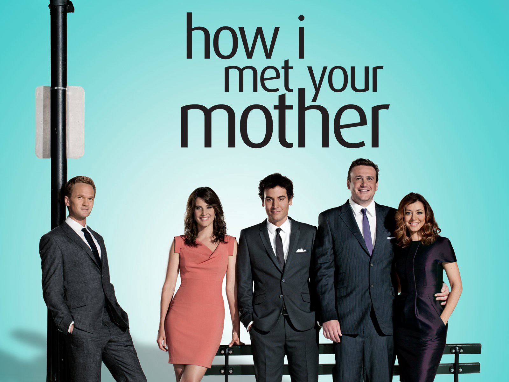

<html>
	<head>
		<title>Our Favourite Series</title>
	</head>
	<body>
		<a href="booksPage.html">Click here to take a look at our favorite books!</a>
		 
		<a href="index.html">Click here to go back to the home page.</a>
		 
		<h1>In this page, you can take a look at some of our favourite series from different genres.</h1> 
		<h2>Here are the genres we will be exploring:</h2>
		<h3>
			<ul>
				<li>Comedy</li>
				<li>Drama</li>
				<li>Fantasy</li>
				<li>Superhero</li>
			</ul>
		</h3>
		
	<!-- ------------------------------------------------------------------- -->

		

		
		<h2>1. Comedy</h2>
		<h3><u>Friends</u></h3>
		

			<b>Summary:</b> &emsp; Friends is a 90's Comedy TV show, based in Manhattan, about 6 friends
			 
			&emsp;&emsp;&emsp;&emsp;&emsp;&emsp;who go through just about every life experience imaginable together; love, 
			 
			&emsp;&emsp;&emsp;&emsp;&emsp;&emsp;marriage, divorce, children, heartbreaks, fights, new jobs and job losses 
			 
			&emsp;&emsp;&emsp;&emsp;&emsp;&emsp;and all sorts of drama.
		

		
		  

		

			<b>Trailer:</b> &emsp;&emsp;&emsp;&emsp;&emsp;&nbsp;&nbsp; 
			<video height="200" controls>
				<source src="trailers/friends.mp4" type="video/mp4">
			</video>
		

		<a href="https://www.imdb.com/title/tt00108778/" style="text-decoration: none;">&emsp;&emsp;&emsp;&emsp;&emsp;&nbsp;&nbsp; Check out the reviews on IMDB!</a>

		<h3><u>New Girl</u></h3>
		

			<b>Summary:</b> &emsp; After a bad break-up, Jess, an offbeat young woman, moves into an
			 
			&emsp;&emsp;&emsp;&emsp;&emsp;&emsp;apartment loft with three single men. Although they find her behavior
			 
			&emsp;&emsp;&emsp;&emsp;&emsp;&emsp;very unusual, the men support her - most of the time.
		

		
		  

		

			<b>Trailer:</b> &emsp;&emsp;&emsp;&emsp;&emsp;&nbsp;&nbsp; 
			<video height="200" controls>
				<source src="trailers/newGirl.mp4" type="video/mp4">
			</video>
		

		<a href="https://www.rottentomatoes.com/tv/new_girl" style="text-decoration: none;">&emsp;&emsp;&emsp;&emsp;&emsp;&nbsp;&nbsp; Check out the reviews on RottenTomatoes!</a>

		<h3><u>How I met your Mother</u></h3>
		

			<b>Summary:</b> &emsp; The series follows the adventures of Ted Mosby, who narrates the 
			 
			&emsp;&emsp;&emsp;&emsp;&emsp;&emsp;story of how he met the mother of his children. The story goes 
			 
			&emsp;&emsp;&emsp;&emsp;&emsp;&emsp;into a flashback and starts in 2005 with the 27-year-old Ted Mosby
			 
			&emsp;&emsp;&emsp;&emsp;&emsp;&emsp;living in New York City and working as an architect.
		

		
		  

		

			<b>Trailer:</b> &emsp;&emsp;&emsp;&emsp;&emsp;&nbsp;&nbsp; 
			<video height="200" controls>
				<source src="trailers/himym.mp4" type="video/mp4">
			</video>
		

		<a href="https://www.imdb.com/title/tt0460649/" style="text-decoration: none;">&emsp;&emsp;&emsp;&emsp;&emsp;&nbsp;&nbsp; Check out the reviews on IMDB!</a>

	<!-- ------------------------------------------------------------------- -->

		

		
		<h2>2. Drama</h2>
		<h3><u>Peaky Blinders</u></h3>
		

			<b>Summary:</b> &emsp; Peaky Blinders is an epic following of a gangster family of Irish Traveller
			 
			&emsp;&emsp;&emsp;&emsp;&emsp;&emsp;or Romani origin set in Birmingham, England, in 1919, several months after
			 
			&emsp;&emsp;&emsp;&emsp;&emsp;&emsp;the end of the First World War in November 1918. The story centres on the
			 
			&emsp;&emsp;&emsp;&emsp;&emsp;&emsp;Peaky Blinders gang and their ambitious and highly cunning boss Tommy Shelby.
		

		
		  

		

			<b>Trailer:</b> &emsp;&emsp;&emsp;&emsp;&emsp;&nbsp;&nbsp; 
			<video height="200" controls>
				<source src="trailers/peakyBlinders.mp4" type="video/mp4">
			</video>
		

		<a href="https://www.imdb.com/title/tt2442560/" style="text-decoration: none;">&emsp;&emsp;&emsp;&emsp;&emsp;&nbsp;&nbsp; Check out the reviews on IMDB!</a>

		<h3><u>Ginny & Georgia</u></h3>
		

			<b>Summary:</b> &emsp; Netflix's Ginny & Georgia focuses on Virginia 'Ginny' Miller and her
			 
			&emsp;&emsp;&emsp;&emsp;&emsp;&emsp;mother Georgia. Despite being only 15 years old, Ginny often finds
			 
			&emsp;&emsp;&emsp;&emsp;&emsp;&emsp;herself feeling a whole lot more mature than Georgia. The show follows
			 
			&emsp;&emsp;&emsp;&emsp;&emsp;&emsp;the family as they move to a town in New England, hoping for a fresh start.
		

		
		  

		

			<b>Trailer:</b> &emsp;&emsp;&emsp;&emsp;&emsp;&nbsp;&nbsp; 
			<video height="200" controls>
				<source src="trailers/ginnyGeorgia.mp4" type="video/mp4">
			</video>
		

		<a href="https://www.imdb.com/title/tt10813940/" style="text-decoration: none;">&emsp;&emsp;&emsp;&emsp;&emsp;&nbsp;&nbsp; Check out the reviews on IMDB!</a>

		<h3><u>Suits</u></h3>
		

			<b>Summary:</b> &emsp; On the run from a drug deal gone bad, brilliant college dropout Mike
			 
			&emsp;&emsp;&emsp;&emsp;&emsp;&emsp;Ross finds himself working with Harvey Specter, one of New York City's
			 
			&emsp;&emsp;&emsp;&emsp;&emsp;&emsp;best lawyers. The question is, how long can they contain his secret?
		

		
		  

		

			<b>Trailer:</b> &emsp;&emsp;&emsp;&emsp;&emsp;&nbsp;&nbsp; 
			<video height="200" controls>
				<source src="trailers/suits.mp4" type="video/mp4">
			</video>
		

		<a href="https://www.rottentomatoes.com/tv/suits" style="text-decoration: none;">&emsp;&emsp;&emsp;&emsp;&emsp;&nbsp;&nbsp; Check out the reviews on RottenTomatoes!</a>

	<!-- ------------------------------------------------------------------- -->

		

		
		<h2>3. Fantasy</h2>
		<h3><u>Shadowhunters</u></h3>
		

			<b>Summary:</b> &emsp; Shadowhunters follows Clary Fray (Katherine McNamara), who finds out
			 
			&emsp;&emsp;&emsp;&emsp;&emsp;&emsp;on her birthday that she is not who she thinks she is but rather comes from
			 
			&emsp;&emsp;&emsp;&emsp;&emsp;&emsp;a long line of Shadowhunters, human–angel hybrids who hunt down demons.
			 
			&emsp;&emsp;&emsp;&emsp;&emsp;&emsp;The series is set in an urban and contemporary New York City.
		

		
		  

		

			<b>Trailer:</b> &emsp;&emsp;&emsp;&emsp;&emsp;&nbsp;&nbsp; 
			<video height="200" controls>
				<source src="trailers/shadowhunters.mp4" type="video/mp4">
			</video>
		

		<a href="https://www.rottentomatoes.com/tv/shadowhunters" style="text-decoration: none;">&emsp;&emsp;&emsp;&emsp;&emsp;&nbsp;&nbsp; Check out the reviews on RottenTomatoes!</a>

		<h3><u>Once Upon a Time</u></h3>
		

			<b>Summary:</b> &emsp; Centuries ago in a land of the Enchanted Forest Disney Hero's and Villians
			 
			&emsp;&emsp;&emsp;&emsp;&emsp;&emsp;alike are frozen in time by the Evil Queen Regina Till a savior was born
			 
			&emsp;&emsp;&emsp;&emsp;&emsp;&emsp;by Snow and Prince Charming will come to a quaint little town of Storybrooke,
			 
			&emsp;&emsp;&emsp;&emsp;&emsp;&emsp;Maine and save all things evil happening in our world. It is up to Emma
			 
			&emsp;&emsp;&emsp;&emsp;&emsp;&emsp;Swan to come and save the citizens of Storybrooke and the realm that started it all.
		

		
		  

		

			<b>Trailer:</b> &emsp;&emsp;&emsp;&emsp;&emsp;&nbsp;&nbsp; 
			<video height="200" controls>
				<source src="trailers/ouat.mp4" type="video/mp4">
			</video>
		

		<a href="https://www.rottentomatoes.com/tv/once_upon_a_time" style="text-decoration: none;">&emsp;&emsp;&emsp;&emsp;&emsp;&nbsp;&nbsp; Check out the reviews on RottenTomatoes!</a>

		<h3><u>Umbrella Academy</u></h3>
		

			<b>Summary:</b> &emsp; On the same day in October 1989, forty-three infants are inexplicably born
			 
			&emsp;&emsp;&emsp;&emsp;&emsp;&emsp;to random, unconnected women who showed no signs of pregnancy the day
			 
			&emsp;&emsp;&emsp;&emsp;&emsp;&emsp;before. Seven are adopted by Sir Reginald Hargreeveswhi who prepares his
			 
			&emsp;&emsp;&emsp;&emsp;&emsp;&emsp;"children" to save the world. However, in their teenage years, the family
			 
			&emsp;&emsp;&emsp;&emsp;&emsp;&emsp;fractured. Years later, some members reunite and work together to solve a
			 
			&emsp;&emsp;&emsp;&emsp;&emsp;&emsp;mystery surrounding their father's death. But things go wrong when they are
			 
			&emsp;&emsp;&emsp;&emsp;&emsp;&emsp;faced with an imminent threat of a global apocalypse.
		

		
		  

		

			<b>Trailer:</b> &emsp;&emsp;&emsp;&emsp;&emsp;&nbsp;&nbsp; 
			<video height="200" controls>
				<source src="trailers/umbrellaAcademy.mp4" type="video/mp4">
			</video>
		

		<a href="https://www.imdb.com/title/tt1312171/" style="text-decoration: none;">&emsp;&emsp;&emsp;&emsp;&emsp;&nbsp;&nbsp; Check out the reviews on IMDB!</a>

		<!-- ------------------------------------------------------------------- -->

		

		
		<h2>4. Superhero</h2>
		<h3><u>Daredevil</u></h3>
		

			<b>Summary:</b> &emsp; The series sees lawyer-by-day Matt Murdock use his heightened senses
			 
			&emsp;&emsp;&emsp;&emsp;&emsp;&emsp;from being blinded as a young boy to fight crime at night on the streets of 
			 
			&emsp;&emsp;&emsp;&emsp;&emsp;&emsp;New York City's Hell's Kitchen neighborhood as Daredevil, while uncovering 
			 
			&emsp;&emsp;&emsp;&emsp;&emsp;&emsp;a conspiracy of the criminal underworld being led by Wilson Fisk.
		

		
		  

		

			<b>Trailer:</b> &emsp;&emsp;&emsp;&emsp;&emsp;&nbsp;&nbsp; 
			<video height="200" controls>
				<source src="trailers/daredevil.mp4" type="video/mp4">
			</video>
		

		<a href="https://www.rottentomatoes.com/tv/daredevil" style="text-decoration: none;">&emsp;&emsp;&emsp;&emsp;&emsp;&nbsp;&nbsp; Check out the reviews on RottenTomatoes!</a>

		<h3><u>Luke Cage</u></h3>
		

			<b>Summary:</b> &emsp; Luke Cage, a former convict with superhuman strength and unbreakable
			 
			&emsp;&emsp;&emsp;&emsp;&emsp;&emsp;skin, keeps a low profile as a sweeper at ex-gangster Henry "Pop" Hunter's
			 
			&emsp;&emsp;&emsp;&emsp;&emsp;&emsp;barbershop, and as a dishwasher at crime boss Cornell "Cottonmouth"
			 
			&emsp;&emsp;&emsp;&emsp;&emsp;&emsp;Stokes' nightclub, Harlem's Paradise.
		

		
		  

		

			<b>Trailer:</b> &emsp;&emsp;&emsp;&emsp;&emsp;&nbsp;&nbsp; 
			<video height="200" controls>
				<source src="trailers/lukeCage.mp4" type="video/mp4">
			</video>
		

		<a href="https://www.rottentomatoes.com/tv/luke_cage" style="text-decoration: none;">&emsp;&emsp;&emsp;&emsp;&emsp;&nbsp;&nbsp; Check out the reviews on RottenTomatoes!</a>

		<h3><u>The Punisher</u></h3>
		

			<b>Summary:</b> &emsp; This series follows FBI agent Frank Castle as he transforms into the 
			 
			&emsp;&emsp;&emsp;&emsp;&emsp;&emsp;vengeful Punisher after criminals murder his family, including his wife 
			 
			&emsp;&emsp;&emsp;&emsp;&emsp;&emsp;and son. Castle is believed to be dead by Howard Saint, the crime 
			 
			&emsp;&emsp;&emsp;&emsp;&emsp;&emsp;lord who ordered the hit. The agent then becomes a heavily armed vigilante
			 
			&emsp;&emsp;&emsp;&emsp;&emsp;&emsp; who will stop at nothing to exact revenge on Saint and dismantle his
			 
			&emsp;&emsp;&emsp;&emsp;&emsp;&emsp;underworld empire.
		

		
		  

		

			<b>Trailer:</b> &emsp;&emsp;&emsp;&emsp;&emsp;&nbsp;&nbsp; 
			<video height="200" controls>
				<source src="trailers/punisher.mp4" type="video/mp4">
			</video>
		

		<a href="https://www.imdb.com/title/tt5675620/" style="text-decoration: none;">&emsp;&emsp;&emsp;&emsp;&emsp;&nbsp;&nbsp; Check out the reviews on IMDB!</a>
	</body>
</html>
